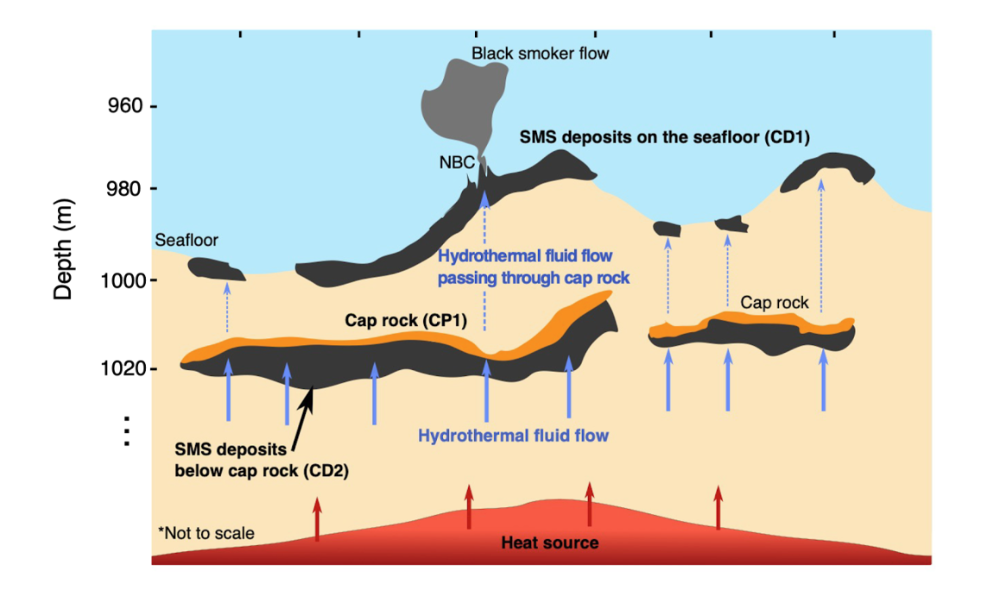

**Ishizu, K.  Goto, T., Ohta, Y., Kasaya, T., Iwamoto, H., Vachiratienchai, C., Siripunvaraporn, W., Tsuji, T., Kumagai H. and Koike K. (2019). Internal structure of a seafloor massive sulfide deposit by electrical resistivity tomography, Okinawa Trough. Geophysical Research Letters, 46(20), 11025-11034.**

### ポイント1：海底熱水鉱床の２階建て分布（上部鉱床と下部鉱床）を可視化に成功
### ポイント2 （最重要ポイント）：下部鉱床の発達メカニズムを新たに解明

海底熱水鉱床は，レアメタルや貴金属を含む次世代型の金属資源です。本鉱床は海底での熱水循環活動が起こる地域で存在が確認されております。日本においては，沖縄トラフ域や伊豆・小笠原海域で海底熱水鉱床の存在が発見されております。しかし，これまで海底熱水鉱床の地下での分布が明らかになっておりませんでした。また，海底熱水鉱床の地下での詳細分布が明らかになっておりませんでしたので，海底熱水鉱床の海底下での発達メカニズムも不明でした。この論文は送信機および受信機が両方ケーブル上で曳航される海底電気探査システムを用いて沖縄トラフの伊平屋熱水域の海底熱水鉱床の分布を詳細に可視化いたしました。海底電気探査は，海底下に電気を流して，海底下の電気の流れやすい場所（すなわち金属鉱床の存在域）を推定できるダウジングマシンのようなものです。もっと簡単に言えば，お宝探しマシンのようなものです。ですので，海底下を掘削することなく，海底下の情報を取得できます。

今回用いた海底電気探査装置は，ケーブルに電気データを計測できる受信機を10 個つけることによりデータ量を格段に増やしました。従来の海底電気探査装置では，5個以下の受信機をケーブルに設置しております。このようにデータ量を増やすことにより，海底下60m程度までの地下情報の詳細化に成功しました。この詳細地下構造マップから，海底熱水鉱床が海底面（上部鉱床）だけではなく，海底下30m程度の深度に存在する（下部鉱床）ということを明らかにしました。この点は，新規性が高いです。この詳細地下構造マップと掘削データなどとを統合して解釈することにより，下部鉱床は，熱水がキャップ層下で冷やされることにより，熱水中の金属成分が沈殿して海底下キャップ層下にできるという発達メカニズムを新たに提案しました。この点は本論文で最も新規性が高いポイントです。

プレスリリース記事は，こちらで読むことができます。[https://www.kyoto-u.ac.jp/ja/research-news/2019-11-01-0](https://www.kyoto-u.ac.jp/ja/research-news/2019-11-01-0)
日経新聞や財形新聞などに取り上げられました。
*財形新聞での記事 [https://www.zaikei.co.jp/article/20191030/537135.html](https://www.zaikei.co.jp/article/20191030/537135.html)*

