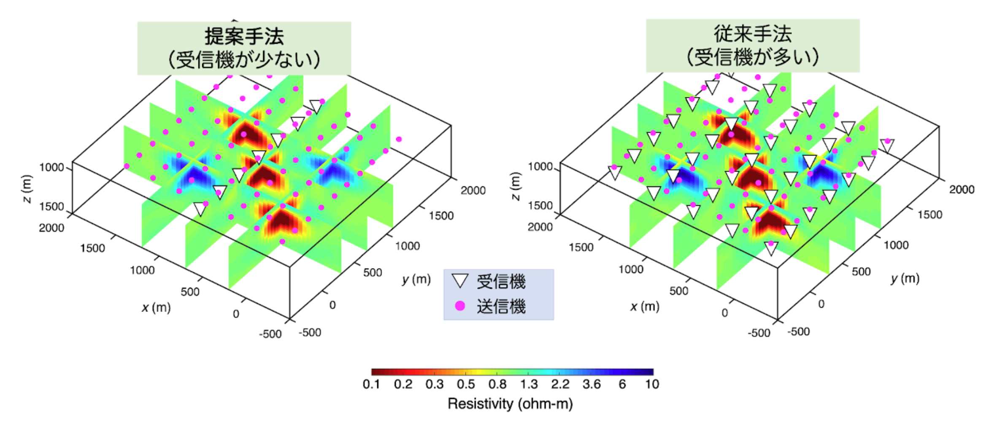

**Ishizu, K. Siripunvaraporn, W., Goto, T. N., Koike, K., Kasaya, T., & Iwamoto, H. (2022). A cost-effective three-dimensional marine controlled-source electromagnetic survey: exploring seafloor massive sulfides. Geophysics, 87(4), 1-75.**

### ポイント1：海底熱水鉱床の3D地下分布情報の取得に成功
### ポイント2 （最重要ポイント）：受信機を減らし調査コストを抑えつつも，海底熱水鉱床の3D地下分布情報を従来法と同等の性能で探査できる新たな3D海底電磁探査技術の提案

海底熱水鉱床の3D地下分布情報の推定には海底電磁探査法が有効です。しかし，既存の海底電磁探査法は海底熱水鉱床の3D地下分布情報を得るために，多数の受信機が必要で調査コストが高いという問題点がありました。そこで，本論文では受信機を減らし調査コストを抑えつつも，海底熱水鉱床の3D地下分布情報を従来法と同等の性能で探査できる新たな3D海底電磁探査技術を提案しました。提案手法は，非常にシンプルなのもので，調査測線の真ん中に一列の受信機ラインを設置するものです。論文ではまず仮想モデル・データを使用して提案手法の有効性を実証しました。提案手法を用いて沖縄トラフのイエヤマ熱水域を探査し，海底熱水鉱床の3D地下分布情報の推定しました。その結果，鉱床体と考えられる領域を推定することができました。

