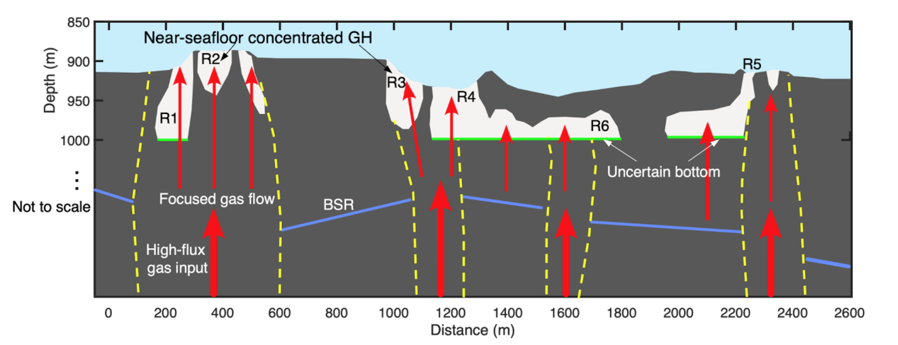

**Ishizu, K. et al. (2024). Electrical resistivity tomography combined with seismic data estimates heterogeneous distribution of near-seafloor concentrated gas hydrates within gas chimneys. Scientific Reports, 14(1), 15045.**

### ポイント1：電気探査と地震探査データによりガスハイドレートの分布を推定
### ポイント2：ガスハイドレートは、ガスチムニー内で偏在して存在することを発見

この研究は、電気探査と地震データを組み合わせることで、日本海側に存在する表層型ガスハイドレートの分布を推定することに成功しました。表層型ガスハイドレートは、深部からガスの供給が多いガスチムニー内に存在します。本研究では、ガスハイドレートはガスチムニー内に均一にハイドレートは存在せず、空間的に不均質に存在することを発見しました。将来的な資源開発や環境保護に関して評価する場合は、このような不均質分布も考慮する必要があることを示唆しています。

