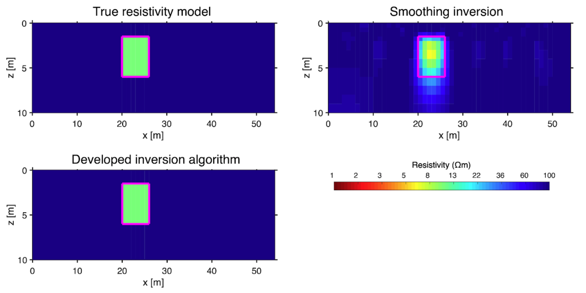

**Ishizu, K. et al. (2025). Inversion algorithm determining sharp boundaries in electrical resistivity tomography. Geophysics, 90(3), 1-46.**

### ポイント1：先験情報に依存しすぎないデータドリブンなシャープ境界再現可能な逆解析アルゴリズム開発

シャープな比抵抗境界を正確に描出できる新しいインバージョンアルゴリズムを開発しました。このデータ駆動型のアプローチは、境界の位置に関する事前の仮定への依存を最小限に抑えることで、大きな進歩をもたらしました。

鋭い比抵抗境界を正確に描出することは、資源探査、特に金属鉱床の探査の精度を向上させるために極めて重要です。本手法は、既存の逆解析コードにABIC探索を組み込むことで実装可能であり、今後多くのコードで利用されることを願っております。

