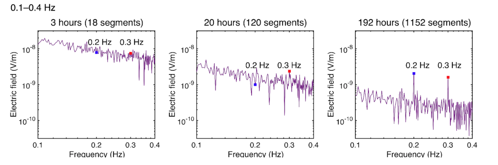

**Ishizu, K. et al. (2025). Controlled-source electromagnetic survey in a volcanic area: relationship between stacking time and signal-to-noise ratio and comparison with magnetotelluric data. Geophysical Journal International, 240(2), 1107-1121.**

### ポイント1：電磁アクロスによりS/N比の大幅な向上を達成
### ポイント2：従来法のMT探査では検出できなかった蒸気層電磁アクロスで発見

従来、火山体などの構造調査やモニタリングには自然電磁場信号を用いるmagnetotelluric（MT）法が主に用いられていましたが、信号源の不安定性と人工ノイズの混入によりS/N比(シグナル/ノイズ)が低下し、その適用に限界がありました。

本論文では、電磁アクロス法という高精度な人工制御信号源を用い長時間計測することによって、S/N比の大幅な向上が可能なことを示しました。この結果は、これまでノイズレベルのためMT法では調査が難しかった地域でも高いS/N比の電磁探査データが取得できることを示唆しました。

加えて、MT法では、水平方向の電場が卓越するため、薄い高比抵抗の検出が困難でしたが、人工信号源を用いることによって鉛直方向の電流を励起できます。このことによって、水蒸気噴火の原因となる蒸気層（薄い高比抵抗体）を検出することが可能となりました。本研究は、電磁気探査に新しい観測方法を提案し研究分野にブレークスルーをもたらしました。

